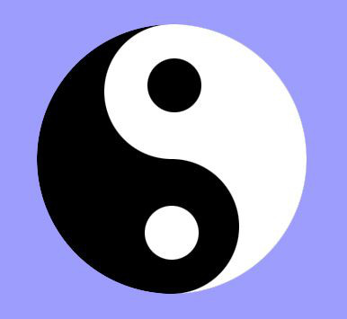
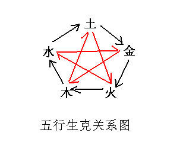
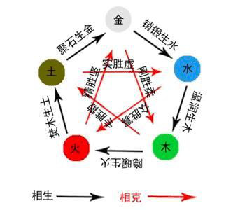
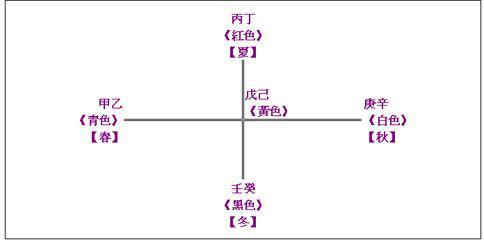
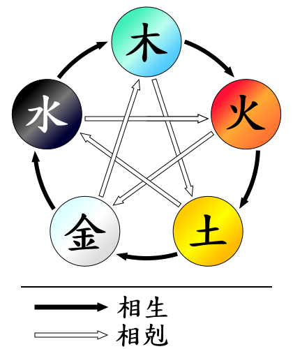
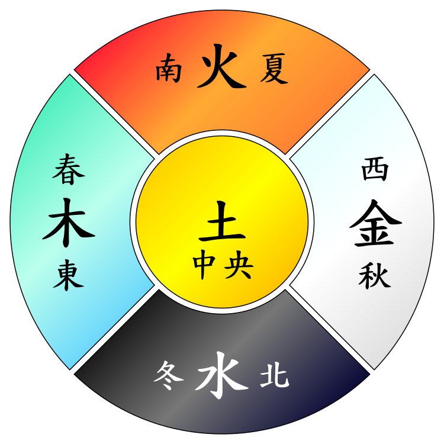

# 老猫教你批八字，你也会成为命理师

如果你对国学八字命理感兴趣，那你就跟我来吧，一起来探寻八字的奥秘，或许将来你会因看此帖成为一名预测大师。

什么是八字算命？简单地说，就是把一个人出生的年、月、日、时用我国传统农历中的天干地支排列出来，形成四柱八字，也叫生辰八字，然后根据阴阳五行理论的生克制化关系，查看八字的作用关系，来判断一个人命运的吉凶祸福。

本文以先人理论为基础，综合众学派名家算法，取其精华 ，融合自身所悟， 故取名为猫派。

我本不喜欢猫，现在的易名却叫老猫，有时候发生在一个人身上的事情就是这样不可思议，这样神奇，这或许是命中注定的一件事情要发生，细想想，是偶然，更多的是必然，冥冥之中似乎有个指引。叫老猫，一个是自己年龄确实不年轻，还有一个就是猫是有灵性的，猫平时就生活在人的身边，我觉得猫是上天派来体察人类的。猫已经被人类驯化了3500年，但未像狗一样完全地被驯化。就凭这一点，我突然间就喜欢上了猫，我就是猫。

还有一个就是我想起了不管白猫黑猫，这点很重要，非常符合我的八字理论思想。

八字命理各个派别我都研读了些，我取其说的在理的为我用，这本帖子汇集了众多名家的八字理论，也有我个人的技术融合其中。

你相信命运吗？如果这个问题问我，我会给你讲一个发生在我自己身上的事儿，小时候我家住农村，记得上小学的时候，那时候家里很穷，母亲有重病，我姥姥领我走了很远的路，去找一位老先生算命，老先生在山上干农活，我们等了一会儿才回来，老先生是一个地道的农民，我心里甚至有些微地失望，我姥姥说了我的生日时辰，老先生用他那长满厚茧的手不断地掐算，什么书也没拿，什么话也没问，老先生话不多，说了句：“能当兵，还能当个小官儿，也可能当老师。”

这个情景异常清晰地印在我的脑海里，我心里想，我不喜欢当兵，我喜欢当老师，因为我崇拜我的老师。

因为家境不好，我没能上高中，开始打工赚钱，或许这就是我一生的命运了，有一天下午，我骑着破自行车准备到海边去进海货，走到村卫生所的时候，看到村里和我同龄的几个伙伴聚集在门口，我问他们在干什么？他们说：“体检当兵，你不想当吗？”我心里一动，马上骑车回去问母亲。

等我再次回到村卫生所的时候，同伴们已经体检完毕，卫生所的负责人说名额也满了，让我找找村领导看看，我晚上就空着手去村长家了，那时候的村领导不腐败，很同情我家，当晚就骑自行车带我到村部，给乡武装部部长打电话，村长说报上去的名单里有个XX有先天心脏病，换一个人吧。把我的名字报了过去。

结果，那年要五个海军名额，我们二十五个人去县里体检，只检查上四个合格，其中就有我。

命运就是这么神奇，当兵，改变了我的生命轨迹。

所以我说，命运，我有一半相信，一半不相信。为什么这样说？因为命运有时侯你可以掌握，有时候自己也难以做主，但是，如果连你自己都放弃了主动，任生命任意漂泊，那你也只能凭天由命了。你本来自己通过努力能够做到的事情你都不去做，又怎么能改变命运呢？

现在我又坐在电脑前开贴讲八字算命，是不是又应了老先生的卦，过一次当老师的瘾呢？

我们有时候找算命先生看八字，不只是为了看到可能的结果，而是为了知道如果可能会出现的困难时，我们应该怎样去化解才能达到最好的效果，一个好的算命先生其实是你命运的医生。一个好的算命先生，不单要理论功底深厚，德行高尚，还要有丰富的人生经历。

八字算命是科学还是迷信？要我回答，八字算命既不是科学，也不是迷信，八字算命是玄学。

存在的就是合理的，不要说古代，就是现今，预测师成为官员、实业家的军师的有很多，有的是世界知名品牌的顾问，有很多知名品牌的名字都是预测大师的杰作。
人各有所仰，如果你感兴趣喜欢的，或者准备学习四柱八字没有找到机会，可以跟我学习。从初级班一直到中级班。

人的命运可以改变吗？要我回答，一个水平高的命理师，完全可以帮助你改变命运。命理师就是你的参谋，指导老师。
我们有时候找算命先生看八字，不只是为了看到可能的结果，而是为了知道如果可能会出现的困难时，我们应该怎样去化解才能达到最好的效果，一个好的算命先生其实是你命运的医生。一个好的算命先生，不单要理论功底深厚，德行高尚，还要有丰富的人生经历。

# 第一课 阴阳理论简介

在探讨五行学说之前，应该简单介绍一下阴阳理论。
阴阳理论一个著名的标志是一个圆从中间以一个S分开，一半白一半黑，白为阳，黑为阴。这就是太极图：

关于阴阳学说，最原始的理论基础是很简单很朴素也很直白，一个物体被阳光照射到的一面为阳，背向阳光一面为阴。又比如，先人们视太阳为阳，视月亮为阴，视白天为阳，视黑夜为阴。一个人，男为阳，女为阴。一件事物，都有好坏两面，也是阴阳的体现。比如现代人有了汽车是件好事，使出行更为方便，但是伴随而来的是交通事故和环境污染等等。阴阳理论还引申出自然界存在的一切现象都有着相互对立又相互作用的关系，并用阴阳来解释自然界两种对立及相互消长的力量关系，并认为阴阳的对立和相互消长是任何事物都具有的现象。根据阴阳消长理论，冷和热之间可以转化，此消彼长，这样的例子很多，一年四季、潮起潮落都是转化的过程。

阴阳理论到底是唯物还是唯心？一直是人们争论不休的话题，西方有学者这样评价我国的阴阳理论：有人把根据客观自然而得来的认识归纳为“唯物主义”，有人凭自己的主观臆想作为真理，就是与“唯物主义”相反的“唯心主义”。中国古人就没有西方人的这些“唯心”“唯物”的麻烦，一个阴阳，把唯物唯心统统装进去。阴阳论，甚至涵盖了唯物论和唯心论。

只有中国的阴阳学说是可以用图形来形象地表达人对世界万事万物的认识，这个图，我们的先人画出来，几千年没有丝毫变化，现在世界上越来越多的人可以凭借这太极图去形象地认识阴阳哲学的概念，并通过中国的阴阳哲学来认识世界。
阴阳理论可以归纳为一下几个基本方面：所有事物都有两面性、对立性、相互依存性、由阴转阳或由阳转阴（相互转换）、阴中含阳、阳中含阴；共存、对立、互依、互动、互生，并不断循环。

阴阳理论究竟是唯物还是唯心，我认为都不是，阴阳理论深层次的问题，以后再做探讨。

阴阳的五个形态，如果用弱和强替代来解释，就是：极弱状态、极强状态、由弱转强状态、弱强平衡状态、由强转弱状态。

# 第二课 五行和五行的相生相克

第一课讲了阴阳论，了解一下就可以了。这一课的五行必须要背会，背熟，这是最基础的。

五行：
五行是木、火、土、金、水五种物质。

五行相生：木生火——火生土——土生金——金生水——水生木。

五行相克：木克土——土克水——水克火——火克金——金克木。

五行相生相克是最基本的常识，初学者一定要牢记熟练。

# 第三课 天干和地支

天干和地支，产生在炎黄时期，是我国的农历历法用的，用天干和地支依次组合，形成六十个组合，现代人大多都使用阳历来看时间，所以对中国古代的历法不是很熟悉，我国古代的历法现在一般叫农历或者阴历，这是一个神奇的发明，现在出的日历上面也都有标注。在我国古代的历法当中采用了十天干和十二地支来记录年月日时的时间。

这一节课先讲十天干，想学八字预测的朋友一定要能背下来，十天干分别是：

### 甲 、乙、 丙、 丁、 戊、 己、 庚、 辛、 壬、 癸

十天干的读法，十天干的读音一定要准确，不要读错了，比如：癸（ｇｕｉ）不能读成“葵”（ｋｕｉ）：

甲（jiǎ）、乙（yǐ）、丙（bǐng）、丁（dīng）、戊（wù）、己（jǐ）、庚（gēng）、辛（xīn）、壬（rén）、癸（gui）

古人发明十天干最初的含义是这样的，这个只做了解就行了：

甲是“壳”，意思就是种子破壳而出。好比胎儿出生。

乙， 看字形就知道是弯弯曲曲的意思，意思是种子在土里破壳发芽弯弯曲曲钻出了地面。好比人的童年时期一样。

丙， 是明亮、显著的意思，指万物初期的快速生长。好比人的少年时期一样。

丁， 是强壮的意思，指万物成形强壮。就好比人的青年时期一样。

戊， 是茂的意思，指万物最茂盛的时期，就像刚结婚的男女。

己， 是已的意思，指万物已经开始孕育下一代。

庚， 是更的意思，指万物已经衰退，就像进入更年期。

辛， 是新的意思，指万物新的种子形成。

壬， 妊的意思，指种子被埋进土里就像妊娠。

癸， 归、藏的意思。指万物闭藏于地下，准备发芽。

十天干分别代表前面学过的五行属性，这个很重要，学批八字的一定要背下来：甲乙是木，丙丁是火，戊己是土，庚辛是金，壬癸是水。

这个很重要，再重复一遍，学批八字的一定要背下来：甲乙是木，丙丁是火，戊己是土，庚辛是金，壬癸是水。

上面讲到的是根据五行理论，把十天干分别赋予了木、火、土、金、水的属性，我们还要根据阴阳理论，将十天干赋予阴阳的属性，先人是这样划分的：

十天干的阴阳属性：

甲 乙 丙 丁 戊 己 庚 辛 壬 癸

1 2 3 4 5 6 7 8 9 10

在十天干的排列中，单数为阳，双数为阴：

属性为阳的是：

甲 丙 戊 庚 壬

1 3 5 7 9

属性为阴的是：

乙 丁 己 辛 癸

2 4 6 8 10

因此，

甲是阳木，乙是阴木，

丙是阳火，丁是阴火，

戊是阳土，己是阴土，

庚是阳金，辛是阴金，

壬是阳水，癸是阴水。

十天干的阴阳一定要记住。

甲为阳木：好比是森林大树，栋梁之木。性质强壮。

乙为阴木：好比是小树花草之木，性质柔软。

丙为阳火：意指太阳之火，熊熊大火。性猛烈。

丁为阴火：意指星星之光，灯火、炉灶之火。火势较柔较弱。

戊为阳土：山川、大地、堤坝之土，广博厚重。

己为阴土：属田园之土，质软肥沃，利于生长。

庚为阳金：属金属矿石、粗重的铁器、刀斧等。坚硬无比。

辛为阴金：属沙金、首饰金、工艺金、钱币之金银，温润秀气。

壬为阳水：属江河湖海之水。清浊全容纳，宽宏大度。

癸为阴水：属雨露、地下泉水。轻柔内敛。

这是十天干各自代表的形象物质属性

# 第四课 十天干的相生

甲乙（木）生丙丁（火）——丙丁(火)生戊己（土）——戊己（土）生庚辛（金）——庚辛（金）生壬癸（水）——壬癸（水）生甲乙木。

### 甲乙生丙丁

### 丙丁生戊己

### 戊己生庚辛

### 庚辛生壬癸

### 壬癸生甲乙

在天干的相生关系中，至少有两种说法，一种认为阳生阳，阴生阴的力量大。例如：甲生丙，乙生丁，同性相生力量大。
阳生阴，阴生阳的力量小。例如：甲生丁，乙生丙。异性相生力量小。
但是也有人认为，阳和阳不生，阴和阴不生。阳生阴、阴生阳的力量大。依据是阴阳相生，就向男女关系一样，男和男，女和女是不能生的。
比如甲不能生丙，只能生丁。乙不能生丁，只能生丙。
好像说的都有道理，如何是好？我认为两种说法都不准确，在相生的关系中，不止是“我”生下一代的关系，应该还含有保护、容纳对其有帮助的关系，像土生金，金生水，都是容纳、支持的关系，所以我认为，看八字时，在五行相生关系当中，不能单纯地套用公式，要看命局中的实际环境来判定。

我们可以做个小试验，把五行相生关系根据自然规律逐一查看一下：

1、 木生火，甲木生丙火，一定旺，甲木生丁火，有大材小用之嫌，但不影响丁火，甚至丁火会转变成丙火，正是星星之火，可以燎原！乙木生丙火有些势单力薄；乙木生丁火，势力相当。

结论：木生火，只有阴生阳的时候，力量小了些，同性相生、阳生阴的力量都大。

2、火生土，丙丁生戊己，丙生戊力量大，丙生己力量大（超大，或许会烧焦），丁生戊力量小，丁生己力量大。

结论同上。

3、 土生金，戊己土生庚辛金，戊土生（藏）庚金的力量大，戊土生（藏）辛金（辛金还是矿石时期）力量大。己土由于是田园之土，变成熟土，几乎不藏金了。

结论：土生金，只有阳土生金，阴土不生金。

4、金生水，庚辛金生壬癸水，庚金生壬水的力量超小，庚金生癸水力量小。辛金几乎不生壬癸水。

结论：金生水，只有阳金能生，阴金极少生。

5、水生木，壬癸水生甲乙木，壬水可以生甲木，也可能冲了甲木，壬水可以生乙木，也可能淹了乙木。癸水生甲木力量大，癸水生乙木力量大。

结论：水生木，阳水既生木但泛滥时也可能克木，阴水生阳木、阴木的力量大。

# 第五课 天干的相克

甲乙（木）克戊己（土）——戊己（土）克壬癸（水）——壬癸（水）克丙丁（火）——丙丁（火）克庚辛（金）——庚辛（金）克甲乙（木）

### 甲乙克戊己

### 戊己克壬癸

### 壬癸克丙丁

### 丙丁克庚辛

### 庚辛克甲乙

分析一下：

### 木克土：甲乙克戊己

1、 甲克戊，根据先人的解释，甲如果是无根无枝叶的栋梁之木，也就不可能克土了，如果戊土是城墙之土，甲木也不可能在其身上生长，只有在甲木是参天大林木，戊土是山川大地之土时，甲木才能在戊土上生长，但是现实情况却是，这种相互依存的克是良性的克，准确的说法，其实是土生木，土也因为甲木的根深而稳固，确保不被大水冲走。

2、甲克己，己是田园之土，本来适宜矮小的植物生长，尤其是当年植物或许更适合，但是我们常常会看到平常的农家院子里生长着几棵大树，绿树浓荫，显得非常和谐，所以，甲克己土也是良性的，所以我们古代的命理大师把甲克己土说成是甲己合，看看，本来是克，演变成了合。

3、 乙克戊，山川大地不仅仅生长着参天大树，期间更是生长着绿草野花，也是那么美丽。

4、 乙克己，田园之土正是乙木生长的最佳地方。

### 土克水，戊己克壬癸

1、 戊克壬，如果戊在这里是堤坝之土的话，正好可以规矩滔滔的江河湖海之水，不能使水失控泛滥，对壬水是一种制约，对壬水有利，是良克。如果是山川大河之土，则会被壬水淹没冲击，两者受伤，是正克。

2、 戊克癸，癸是雨露之水，地下泉水，癸水润泽戊土，对戊土有利。是良克，所以也有戊癸合的说法。

3、 己土克壬水，己土是田园之土，遇到江河之水，己土受伤。

4、 己土克癸水，己土受润泽，是良克。

### 水克火，壬癸克丙丁

壬水遇丙火，丙是烈火，壬是江河湖海之水，烈火抵挡不住，烈火受伤，或者有灭顶之灾。所以把这种克说成冲，壬丙相冲，是很厉害的冲。如果丙是太阳之火，两者相得益彰。
壬水遇丁火，势力悬殊，丁必亡无疑。
癸水遇丙火，雨露之水会使烈火收敛，不致过旺伤身，是良克。
癸水遇丁火，丁火受重伤。

### 火克金，丙丁克庚辛金，烈火炼金才能成器，否则就成废铁。

从仔细排列可以看出，天干相克，有的相克并不一定是坏事，甚至是好事情。

十天干的相生相克试验结果出来了，发现有跟先人讲的理论有出入的地方，并不是那么完美匀称，令人似乎产生些微失望和缺憾，但这恰恰是体现出了阴阳理论的精髓：五种形态不断地变化演绎，从实践观察当中发现的生克关系，恰恰证明了阴阳转换、五行生克过程当中不断变化的关系，或强或弱，或有或无，或利或害，不同物质之间相生相克的结果也不尽相同，这才是物质世界奇妙的本质。

在反生为克论里，是这样说的：“火赖木生，木多火塞”。在实际看八字分析的时候，甲木特别旺丁火，农村烧柴禾，如果灶里面放多了，反而不容易着起来，有时候甚至会熄灭。如果八字中木多，火小，或许预示着这个人比较喜欢安逸的生活，不愿意吃苦。或者太娇惯子女，对子女反而起了负面作用。

# 第六课 十天干的相合

天干的相合又叫天干五合，这个很重要，批命时都要用到，意思是两个天干结合到一起，会合化变身成一种物质，八字命局中出现相合，会改变原来的形式，所以命运的解读也不同。

天干五合分别是：

### 甲己合，变成土。

### 乙庚合，变成金。

### 丙辛合，变成水。

### 丁壬合，变成木。

### 戊癸合，变成火。

天干的相合是以这五种形式出现，天干的相合，没有科学的理论依据，不能用逻辑分析它对不对，这是老祖宗规定下来的，在八字预测中运用很广泛，也很实用。
天干相合也非常好找规律，仔细观察可以发现，两干之间原本都是相克的关系，并且都是阳干克阴干：甲克己，成为甲己相合，庚克乙，成为乙庚相合，丙克辛，变成丙辛相合，壬克丁，变成丁壬相合，戊克癸，变成戊癸相合，因此，它们的关系都要以相合来论。

根据相克理论，相合的两天干本来是相克的，但是他们为什么又被规定了相合呢？关于天干相合，有一个故事，我讲给大家听，甲乙（木）克戊己（土），戊哥哥为了讨好甲乙（木），把自己的妹妹己土嫁给了甲木为妻，所以甲己相合，庚辛（金）克甲乙（木），甲木为了讨好庚辛（金），把自己的妹妹乙木嫁给了庚金做妻子，丙丁（火）克庚辛（金），庚金为了讨好丙丁（火），把自己的妹妹辛金嫁给了丙火做妻子，壬癸（水）克丙丁（火），丙火为了讨好壬癸（水），把自己的妹妹丁火嫁给了壬水做妻子，戊己（土）克壬癸（水），壬哥哥为了讨好戊己（土），把自己的妹妹癸水嫁给了戊土做妻子。

由此看来，我们的老祖宗规定的天干相合，主要是为了保稳定、促和谐，用自己的妹妹换来平安和平衡。
这样来理解，就容易记住了。
天干相合在实际运用当中有如下特点需要掌握：

甲己合化土，是中正之合，主安分守己，厚道热情。

乙庚合化金，是仁义之合，主刚柔兼备，重名誉讲信义。

丙辛合化水，是威严之和，表现为注重仪表，有头脑。

丁壬合化木，是仁寿之合，主心地善良，长命多寿。

戊癸合化火，代表无情之合，表现为娇媚风流，薄情寡义。

# 第七课 十天干的相冲

天干的相冲也叫“天干四冲”，是八字算命很有名的词汇之一，所以必须要掌握是哪“四冲”。

什么是相冲？相冲其实就是五行相克的一种，相冲同相克比较，就是双方势均力敌，互不相让，分不出高低，相冲与相克相比，发生的非常急，非常快，在看事上面就是表现的非常突然。

相冲（天干四冲）：

### 甲庚相冲、乙辛相冲、壬丙相冲、癸丁相冲。

天干相冲只有这四个，所以也叫四冲。观察可以发现，四冲里面没有戊己土，这是因为戊己土在中央。

甲属阳木，为东方，庚属阳金，为西方，阳与阳相对，金与木相克，而且二者一个在东一个在西，方位截然相反，所以相冲。

丁癸相冲，一个南，一个北；一个火，一个水；一个南，一个北，同属阴。
因此可以得出结论：相冲是金木交战、水火交战，它们之间的交战最无情。
因此得出结论：相冲的双方属于同性，就像两个男的相互打架，或者两个女的相互打架，同性交战最无情。

### 真正的相克
除了相合、相冲，剩下的才是真正的相克了，十天干的相克：

### 甲戊相克

### 乙己相克

### 丙庚冲克

### 丁辛相克

### 戊壬相克

### 己癸相克

相克的含义是一方可以制约另一方，一方强势，一方弱势。

### 十天干的所属方位

十天干的方位自古就有了。在道家文化当中，上香拜神有拜四方、上下天尊的礼仪，也有拜四方五行的礼仪：“一拜东方甲乙木，二拜南方丙丁火，三拜西方庚辛金，四拜北方壬癸水，再拜中央戊己土……。” 在《庚申宝卷科仪》中，有:斋主今日接庚申。要拜五方五星君。一拜东方甲乙木。木星高照长庚星。二拜南方丙丁火。火光贼盗尽除根。三拜西方庚辛金。金星常照命中存。四拜北方壬癸水。水灾厄难尽除根。五拜中央戊已土。百样万物土中生。……传统结婚礼仪中也有：某月某日好时光，某氏门中喜气洋洋；某某某与某某某，配对成双，梳洗整衣来拜堂；一拜东方甲乙木，二拜南方丙丁火，三拜西方庚辛金，四拜北方壬癸水，五拜中央成已土，六拜本方诸神灵，七拜某氏祖先人，八拜家中老寿星，九拜高堂父母亲，十拜亲朋和友人。最后夫妻双双拜，高高兴兴入洞房。

所以天干有方位是自古就传下来的。尤其在八卦及八字预测中，有天干主空间方位，地支主地势方位之说。

天干与方位及季节配属：甲乙东方木，属春；丙丁南方火，属夏；戊己中央土，属长夏；庚辛西方金，属秋；壬癸北方水，属冬。

在具体的应用当中也是非常有用处的，比方一个人的八字喜用神是甲乙木，可以起名叫“东”，如果喜用神是丙丁火，可以起名字叫“南”，如果喜用神是庚辛金，可以去居住地的向西方向发展，如果喜用神是壬癸水，可以去北方发展等等。同地支的实际应用相同。

在八卦当中十天干的五行方位这样排列的：

东方，木代表四季里的春天，寓意萌芽，对应甲乙；

南方，火代表四季里的夏天，寓意成长，对应丙丁；

西方，金代表四季里的秋天，寓意收获，对应庚辛；

北方，水代表四时里的冬天，寓意蕴藏，对应壬癸；

中央，土代表一切的最后归属，寓意结束，对应戊己。

十天干配四季和方位

配四季方位：甲乙木配在东方，因此东方属木，东方属于春天，丙丁火配在南方，因此南方属火，南方属于夏天，庚辛金配在西方，所以西方属金，西方属于秋天，壬癸水配在北方，北方属水，水冷，所以北方属于冬天。戊己土位居中央。

请注意一下：在我国古代画方位图，是上为南方，下为北方，左为东方，右为西方。与现代的方位图正好相反。

古人画方位图是面朝南方，叫面南背北。现代人画方位图是面朝北方。

下一节课开始讲十二地支，感兴趣的朋友可以去书店买一本万年历，一定要正版的，以防出现差错。讲完十二地支，就需要万年历这个工具来排八字了。

补充一些图：

### 对五行论的解读

五行学说是一部兵法

我们的先人创造的五行学说，几千年来在很多领域广泛的运用，也证明了五行学说的适用性，但是五行学说始终也存在着种种疑问，疑问的根源，主要是“五行学说是根据自然规律创造”的，这个说法无法证明，按照“自然规律”法则来反证五行学说会发现其存在的很多问题解释不清楚，甚至有相互矛盾的地方。那么五行生克关系到底是不是来源于自然法则，如果不是的话，那它是根据什么得来的？至今也没有人能够解释清楚这个问题，选择几个主要疑问来说说：

1、五行学说认为世界都是由金、木、水、火、土这五种基本物质组成的这个观点对吗？
古希腊人认为世界是由水、火、土、空气四种物质组成，把空气视为重要物质，里面没有木、金，古印度人认为世界是由水、火、土、风组成，也没有木、金，客观地看，他们的讲法看起来似乎更科学，现代人都知道，我们生活的世界如果没有空气会是什么样子？可是先人的五行学说当中并没有空气这个重要物质，如果按照五行归类，空气应该是五行当中的哪一“行”呢？是水？不是。是木？也不是。是金？更不是。木没有空气不能生存，火没有空气不能燃烧，金没有空气不能冶炼。空气既然不能归类到其他五行当中，那世界是不是应该说还存在“六行”、“七行”？如果答案是肯定的，那么五行学说就是错误的或者说对世界是由五行构成的学说是错误的。

2、如果说五行学说是先人根据自然规律发现的，那么在对金这种物质的解读当中明显地是人为因素创造的，金是经过人工冶炼出来的一种新物质，比如对金克木的解释，基本上都是把这个金解释成器具，器具不是自然形成的，是人制作的。这与水、火等属于自然存在的物质明显不同，这也是古希腊、古印度没有把金列在他们的“四行”里面的原因吧，这样来看，五行理论至少不是源自纯粹的自然规律理论。退一步说，为了维护五行论是来之自然规律的说法，把金看成是纯天然的金属矿石物质，那么实际上它很难同木发生自然运动关系，金的常态是一直存在在“土”里的，古代的先人估计也很难观察到在自然环境下的金与木发生关系，在自然环境中，金影响物质环境变化的作用很小，远远比不上空气的作用。与其他像木、火、水、土之间的时常发生的接触关系是有本质上的不同。

3、在五行相生当中，有木生火，其中有一种解释是钻木取火的意思，钻木取火严格来说是人为的结果，有人的劳动成分在里面。还有金生水，这个金生水到底怎么解释？有说是被火融化的金属为水，可是这个水显然不能生木的，融化的金属水也不能成为常态水存在，此水非彼水，并且这种用火融化的金水显现出来的是人劳动的痕迹，不是自然的行为；有的解释说是金的物体上冷凝的水珠，古人就认为是金生水，这个说法首先一点，就是这里提到的金属这种物质是人工提炼出来的；如果世界上的水都是因金生出来，会需要有多少金存在啊！也有解释说是用金属器皿盛水，就叫“金生水”，这种解释证明了金生水是人类的行为了，不是自然现象。在自然环境当中，金属被水侵蚀会生锈烂掉，是自然现象，为什么不说水克金哪？。在古代，我们的先人还不能解释下雨的现象，为什么不说天生水？遇到干旱，人们为什么向老天求雨不向金求水？现代科学也证明水并不是金生的，单凭这一点，说五行相生是来自自然规律的链条就要断裂开。在金克木的解释中，几乎完全是金属工具对木的砍伐，在这个动态中，既表明了金是经过人加工出来的工具，也有人通过金这种工具”伐木”的这种劳动行为,从而也证明了不是纯自然现象。

4、在五行相生当中，为什么说水生木？不说土生木？树木都是扎根在土地上生长的，土对木的作用更直观，这是最基本的常识，没有哪种树木是在湖面或者海面上生长的，这个现象先人应该看的很清楚。关于土生金，也是先人观察到的自然现象吗？我们现在已经知道，矿藏是一种不可再生资源，土生金是先人的主观解释还是另有含义？

5、在五行相克中，出现了木克土，后人大多解释的原因是木的生长能使土变“瘦”。在自然界当中，大水能冲走泥土，使山体塌方，相对于木克土，水对土的这种危害更大，为什么不说水克土？可是在物质相克当中却出现了土克水，这是为什么？现代人已经意识到，在自然环境里林木对水土保护起了不可替代的作用，木与土是相互偎依的关系更多。还有火克金的观点，如果在自然环境当中，火对木的破坏力更大，为什么不说火克木？在相生关系中却出现了木生火？我们的先人这样编排的原因是什么？

6、五行当中为什么只有木是有生命的物质？世界上有生命的物质除了木还有与木区别很大的生命存在，就是动物，为什么五行里不设置动物？

类似这样的疑问有很多，从古至今人们对五行论的成因做出了多种多样的解释，并因此涌现了各种流派学说，可是没有一种解释能把这些矛盾和疑问说清楚。有人为了论证五行理论的正确性，避开这些矛盾，另辟蹊径，做了各种的变形解读，如：五行指的不是真实的物质，只是五个符号，如果真是符号的话，为什么不用其他的字？偏偏是这五种物质？显然不符合情理。也有的把五行学说说成是时空论，更是把五行理论复杂化，神秘化，如此等等，有的关于阐释五行原理的理论似乎接近了真相，但是细细考量，总是差那么一点点而通不过去。其实，这些理论只不过是依照五行学说变相衍生出的近似理论而已，并不能替代五行学说本身，也远远不能同五行学说的深奥和精妙相提并论。

既然从历史记录当中找不到关于五行学说起源的原始证据，无从考究，做引申演绎也无法解开谜团，我们只有再回到五行学说的本身去寻找去探寻，看看能不能寻出一些踪迹。

解读五行学说的第一个大问题，不是去证明它的正确与否，也不要因为解读而去牵强附会。真正的解读，是尽可能复原五行论的原貌，哪怕它不是想象的那么完美。那么，先人的五行学说里面真正想要表达的是什么思想内容？

第二个问题是要想探寻五行学说的真谛，首先要明确应该从哪个方向来入手，从对五行学说的一些难解的疑问开始入手是一个很好的选择：

*五行学说到底是不是先人从客观地观察自然关系得来的？这是最关键的问题，就从这个问题来探寻。

从上面列举的对五行相生相克关系存在的疑问会发现，五行论表现的相生相克关系不完全是自然环境发生的关系，既有客观自然关系，也明显掺杂了一些人为力量的因素，也就是人类劳动的痕迹。

这是最关键的发现，那么，先人的五行学说为什么会出现客观自然关系和有人类行为参与的五行论呢？这很难令人理解。

如此，不如再换一个角度，如果确定五行论不是反映客观自然环境下的物质关系的话，那么先人的五行理论描述的生克关系是不是全部都是纯粹的人类的行为呢？这是一个非常令人振奋的想法。

要想证明究竟是不是纯粹的人类行为，首先要确定的是五行生克关系人类当时都能不能做到呢？答案是肯定的，五行相生相克的关系当时的先人已经完全掌握！五行生克制化既然在自然环境下不可能顺利实现，也解释不通，而当时先人的行为完全可以做到，那是不是人类的主观行为？如果是这样的话，那么五行生克理论被认为是客观自然规律的观点是不是后人的误读呢？先人最初写下的五行生克关系是不是对自己认识自然，利用自然的真实写照呢？

为了求证五行理论是人类主观认识自然，利用自然，战胜自然，为人类服务的思想，我们再以人为主角，来参与五行的生克制化，看看会有什么答案？

先拿五行相生关系来检验，让我们重回远古时代，那个时期还是刀耕火种的时期，我们的先人在告诉他的后代，地里的庄稼需要浇水才能生长的更好（水生木），庄稼秸秆和树木的枝杈可以燃烧生火做饭（木生火），把野地里的荒草烧掉就有了种庄稼的土地，烧成的草灰也是土啊（火生土），在后山那边挖开的土层里边有金属矿（土生金其实是土藏金），把这些挖出来的矿石用火煅烧可以造出我们需要的工具，我们可以用工具把水引到家的附近，也可以打井出水，我们也可以用造出来的器具盛水（金生水）。。。。。。

用人的行为来解释五行相生理论，一切概念都是那么顺其自然！

原来我们先人的五行理论最初并不是在讲客观的自然规律，而是在告诉我们利用自然为我所用的方法。因此发现，我们的先人创造五行理论最初的意图不是讲自然规律，是在讲人类的劳动生活方法，讲人类应对自然的方法，五行关系是人类主观利用自然的智慧，其中更有令人惊奇的发明创造，像把金属矿石冶炼后做出器具，就是发明创造，先人把自己应对自然的经验和发明创造记录下来，告诉后人，传授给后人：水生木，木生火，火生土，土生金，金生水。

五行理论体现的是先人学会掌握利用自然的力量为我所用、对我有益的主观思想，因此我们知道了先人为什么说水生木，而没说土生木的真正原因，先人告诉我们的意思是种植的庄稼需要浇水才能长得更好，他这里（水生木）最关注的是庄稼（木）而不是水或者土，水生木是一种方法，是先人传授给后人的一种种植技术手段，这里的木才是人的利益所在。

在五行相克关系当中，我们因此明白了先人为什么说木克土，先人的意思是种植过庄稼的土地养分被吸收，土质会变瘦，需要施肥才行，这里，土成了关注的目标，如果是纯自然的环境状态，不以人的利益为目的，先人一定不会这么说。我们明白了先人为什么说土克水，先人的意思是用土筑堤坝可以使水按照我们的意愿流淌，用土来“规范”水从而对人有益，我们明白了先人为什么说水克火，先人的意思是如果遇到火灾，可以用水浇灭，我们明白了先人为什么会说火克金，先人的意思是用火可以融化坚硬的矿石制作工具，我们明白了先人为什么会说金克木，这是先人在告诉我们用刀具来收割庄稼砍伐树木。

在解释五行相克的理论著作中，其中有这样的说法：“赤裸裸的大地一定要植树(木)，用大树的根来拱固土质，大雨来时才不会土质流失(土)，大雨会造成水灾就必需用土来筑坝保卫家园(水)，古时家园的门口都要摆个大水缸下雨时备水以备火灾可灭火(火)，为保卫家园及家中煮饭生火必需有刀枪斧头器具所以要提炼顽铁(金)，生火需要用锯子斧头来劈材(木)，这相克制衡道理就是木克土→土克水→水克火→火克金→金克木。”从解释当中，我们看到了以人的利益为根本的思想。

在相克论中，木克土明显是以人的意志和利益这个角度来看问题的，并不是从自然的角度，金克木，使用刀具来砍伐木材，收割庄家，土克水，用土筑堤坝挡水，都是以人的利益为出发点的。

根据五行延伸出来的其他理论，如：五行正克、反生为克、泄多为克、反克，我们还会有惊人的发现，先人还告诉我们，光知道了相生相克还不行，还要认识到，刀具虽然能收割庄稼，如果拿着它去砍山后的大树，大树木质坚硬，刀具也会掉牙卷刃的（“金能克木，木硬金缺”。五行反克）。庄稼能使土地变瘦，但是施肥过多，庄稼也会夭折（“木能克土，土重木折”。五行反克）。土能挡水，但是如果水太大的话，土坝会被水冲垮（“土能克水，水多土荡”。五行反克）；水能浇灭火，但是用旺火也能把水烧干，阳光太烈，土地里的水也会蒸发了（“水能克火，火旺水干”。五行反克）；火能炼矿石，但是火不旺没有用处，矿石多了也能把火压灭（“火能克金，金多火熄”。五行反克）；只有火旺，才能铸出工具。山后的大树，可以需要用刀锯修剪才能长成我们盖房子用的栋梁（“木旺得金，方成栋梁”。五行正克），水虽然能使庄稼生长，但是雨水多了或者发大水淹了庄稼，庄稼就会飘起来或者淹死（“木赖水生，水多木漂”。反生为克）；火能生土，用土覆盖也能控制火势（“火能生土，土多火晦”。反生为克）。。。。。。

虽然这些延伸的理论可能是后人所为，但主要思想也都是以人类的利益在谈，知道了我们先人创造五行学说的初衷和立场，一切疑惑就都迎人而解了。《左传》里面对五行的说法是，“天生五材，民并用之，缺一不可。”把五行称作五材，意思是自然界存在和产生的这五种基本物质是百姓生活必须的，也是从人的角度来阐述的。“金旺得火，方成器皿；木旺得金，方成栋梁。”也是从人类的需要得来的。

站在人的立场，我们理解了先人的五行学说当中为什么没有空气，作为当时来讲，空气还不是劳动的标的物，因此也可以说明，五行物质是人劳动的对象，这五种物质恰好在人的作用下相互转化为人所用。说成是先人把五种物质看成是组成世界的基本物质，也是误读。

我们还可以从天干地支的解释当中去寻找踪迹，在解说天干甲木时，不但只有大林之木，还有无根无枝，栋梁之木的说法，这显然又是在为人的利益在说话，不是为自然说话，其目的是为人类服务的，因为在自然界，抛开人类的需要，栋梁之木和枝枝杈杈没有什么区别，燃烧了之后都一样成土灰。在对庚金、辛金的解释中，庚是斧钺，斧钺是工具，是人类劳动的产物，自然环境没有，辛是首饰之金，也是人类劳动获得的产品。

我们还可以从五行纳音中找到人类活动的答案，在纳音五行当中，有城墙土、路旁土、屋上土、壁上土，有金薄金、白蜡金、剑锋金、钗钏金，有石榴木、松柏木、杨柳木，所有这些都是人类劳动的产物，不是自然环境下生成的物质。

我们的先人当时已经学会掌握了用火，学会掌握了用水灌溉，学会了种植庄稼，不再以狩猎生存，所以我们理解了为什么五行当中只有木，没有动物的原因，那很可能是在农耕时期，我们的先人甚至学会了冶炼，开始使用金属制造的工具，应该是距今5000年左右。我们的先人把这些都用五行记录下来，这个“行”字，不止是解释成变化，可不可以也解释成方法呢？行之有效的方法。这是先人学习自然，利用自然，改造自然的过程，先人不是在研究组成世界的物质，而是研究如何利用这些物质。我们的先人怎么会想到，他的后人利用五行学说当中隐藏的不断创新精神创造出的今天的大千世界，早已经今非昔比。

我们的先人编撰五行论的初衷，不是为了宣讲自然规律，他们是把自己发现自然、利用自然、改造自然、在生产劳动中解决问题的技术方法，记录下来传给后人，或许就是一个口诀，一副心得，一首歌谣，五行学说可以说是人类生产劳动中的兵法，应对自然的兵法，只是这个兵法是利用自然来应对自然，过于巧妙，其中既包含自然规律也有人类的智慧行为在里面，而大多数的后人只看到了反映自然规律的一面忽视了其中先人智慧和劳动行为。

不要以为先人发现运用的这些技术太简单，对先人而言，每当掌握了一种应对自然的方法，都是一个巨大的进步，先人发现的用火技术、冶炼技术，种植技术，堪与当今的计算机互联网技术相比，五行学说其实是人类最早的在劳动当中总结出来的科学技术理论著作。

先人最初的五行学说不是在讲自然环境下物质的生克循环规律，而是在讲我们人类同大自然斗争的手段，这是我们人类的劳动行为，只是这些劳动行为和技术手段当中充分利用了后人认为的客观自然规律而已。由此看出，五行理论最初即不是自然规律也不是哲学思想，而是当时最先进的生产技术，在大自然面前，我们的先人不是消极地逃避自然，而是利用自然战胜自然，把不利变为有利。

如果按照先人想揭示自然规律的思路去探究，按照先人当时对自然界的了解，想编辑出一个比五行论更贴合自然规律的生克法则也不是不可能的，或者三行生克，或者七行生克，或许就有土生木的出现，现代科学已经证实，在每一个不同的地域当中，草原、森林、海洋，不同地域的生物都有各自的生存链条，这个链条的内涵同五行生克的原理是一样的。但是任何一个比五行生克更符合自然规律的生克链条理论出现，也不会有五行生克这样影响久远，深入人心。

初始五行学说的主角，不是自然，而是人，是人根据自己的需要对五行排兵布阵，五行学说最初不是哲学不是自然规律也不是唯心，是技术，是方法，这就是五行学说的起源。

种种证据表明，先人创造的五行学说就是教导后人如何在这个世界生存的方法。西方的圣经在告诉他的后人上帝是怎样创造了人类，我们先人的五行论是在指引他的后人应该怎样应对自然，使我们的生活变美好，这就是五行论最初原意。
由于社会的发展，到了一定的时期，本是生产技术的五行理论逐步退到幕后，巧妙的是由于五行生克关系当中隐藏的精妙哲理被后人发现，最终使五行学说逐渐演化成哲学理论，经过不断完善、充实、甚至神秘化，使五行理论变得扑朔迷离，形成了今天的五行理论体系。

探寻五行学说的演变过程，对五行理论的正面解读将起到巨大的积极作用，五行学说背后所隐含的是我们先人面对世界的积极态度、务实态度、科学态度、创新精神，在困难面前不萎缩、不低头、不消极，了解到这一点会鼓舞我们后人勇敢地面对生活。
发现五行学说的原始理论的作用还在于，能使我们后人重新审视根据五行理论衍生出来的各领域理论，防止因错误的解读而产生怀疑和谬误。

探源五行原始理论不仅仅在于解除世人对五行论长期存在的不解和疑惑，它更大的意义在于从五行学说解读出华夏民族极向上的精神，五行论应该成为一种生活信仰，五行论是指导我们人生的瑰宝。

探寻五行学说的演变过程，将对五行论的应用会起到积极的作用，五行学说背后所隐含的是我们先人应对自然的积极态度和创新精神，了解到这一点会鼓舞我们后人勇敢地面对生活。五行理论蕴含的是不凭天由命，是积极向上的奋斗精神，也是我们命理研究者应该学习的。
冥冥之中隐藏着暗示：五行论既然是一部兵法，我们就完全可以做到窥探命理玄机寻求方法来改变命运。

五行生克的现实演化

这是先人们根据五行生克理论在实际运用当中获得的经验总结，比单纯静态的生克关系动态了，复杂了，五行之间数量上的多寡会改变原先的生克关系，从口诀的字义就很容易理解的，在这里就不多做说明了，因为在以后的批断八字时会经常的讲到，这个不必死记硬背，一看就明白了。

（1）五行正克

金旺得火，方成器皿；

火旺得水，方成相济；

水旺得土，方成池沼；

土旺得木，方能疏通；

木旺得金，方成栋梁。

（2）反生为克

金赖土生，土多金埋；

土赖火生，火多土焦；

火赖木生，木多火塞；

木赖水生，水多木漂；

水赖金生，金多水浊。

（3）泄多为克

金能生水，水多金沉；

水能生木，木盛水缩；

木能生火，火多木焚；

火能生土，土多火晦；

土能生金，金多土虚。

（4）反克

金能克木，木坚金缺；

木能克土，土重木折；

土能克水，水多土荡；

水能克火，火旺水干；

火能克金，金多火熄。

上面的描述很直观的，都是现实生活当中存在的现象。

# 第八课 十二地支

讲完了天干，现在开始讲地支，地支是十二个，比天干多两个，它们分别是（按顺序排列）：

子(zǐ)、丑（chǒu）、寅（yín）、卯（mǎo）、辰（chén）、巳（sì）、午（wǔ）、未（wèi）、申（shēn）、酉（yǒu）、戌（xū）、亥（hài）。

注意不要读错了，比如，寅，不读演。戌也不要当成天干的戊，巳也不是天干的己。

#### 十二地支的阴阳：

子、丑、寅、卯、辰、巳、午、未、申、酉、戌、亥

1、 2、 3、 4、 5、 6、 7、 8、 9、 10、11、12

单数为阳：子寅辰午申戌

双数为阴：丑卯巳未酉亥

#### 十二地支的五行：

木是：寅卯是木

火是：巳午是火

金是：申酉是金

水是：子亥是水

土是：辰丑未戌四个全是土，其中辰丑是湿土，戌未是燥土。

十二地支五行的阴阳，同天干一样，按照十二地支的排列次序，单数为阳，双数为阴，所以：寅是阳木，卯是阴木，午是阳火，巳是阴火，申是阳金，酉是阴金，辰戌是阳土，丑未是阴土，子是阳水，亥是阴水。

#### 十二地支的含义
这个做个了解就可以了：

子，是滋生的意思。

丑，是刚发了一个小芽。

寅，是快速生长时期。

卯，是枝叶开始繁茂。

辰，是震动的意思。

巳，是开花。

午，是达到极盛，开始结果。

未，是味道，指万物的种子散发出香味儿。

申，是身体，指种子成熟。

酉，是开始老化。

戌，是开始枯萎。

亥，是核，指种子，藏入地下。

#### 天干与地支相对应

甲木与寅木是哥俩，

乙木与卯木是姐妹，

丙火与午火是哥俩，

丁火与巳火是姐妹，

戊土与辰土、戌土是哥俩，

己土与丑土、未土是姐妹，

庚金与申金是哥俩，

辛金与酉金是姐妹，

壬水与子水是哥俩，

癸水与亥水是姐妹。

哥俩、姐妹就是根，地支是天干的根基。

# 第九课 十二地支代表的月份

十二地支的作用很多很多，也很复杂，比十天干要复杂多了，地支的第一个作用是用这十二地支来代表十二个月份。十二地支代表十二个月是这样的：

#### 寅是正月 ，卯是二月，辰是三月，巳是四月
#### 午是五月，未是六月，申是七月，酉是八月，
#### 戌是九月，亥是十月，子是十一月，丑是十二月。

这个要背下来，不能搞错。

这里要注意：

1、这里所讲的月份是指农历，也就是老百姓说的阴历。不是阳历，千万不要搞错，有告诉你阳历出生月份的朋友，你要查万年历换算成农历才能排八字。

2、正月不是从子开始，是从寅开始按顺序往下排的，子丑在最后的两个月，是冬季，子为水，冷嘛，所以是冬天。

3、月份上的地支是固定的，无论哪一年，寅月都是正月，二月都是卯月，三月都是辰月，以此类推。

还有一点，通过十二地支的五行属性，所以有一、二月为木，四、五月为火，七、八月为金，十、十一月为水，三、六、九、十二月为土的说法。

# 第十课 十二地支所代表的时辰

时辰，是过去人看时间的单位，就好比现在说的几点几点一样，时辰是用十二地支来代表的。

时辰，就是看时间的一个名词，过去看时间不是问几点几分，是用时辰，我们的先人把时间以年、月、日、时辰来划分，一天二十四小时划分成十二个时辰，每个时辰相等于现在的两小时。相传先人是根据中国十二生肖中的动物的出没时间来命名各个时辰的，这是时辰的表格，每个时辰对应的北京时间要背下来，不能搞错。

十二个地支配十二个时辰：

时辰 北京时间

子时 23：00～1：00

丑时 1：00～3：00

寅时 3：00～5：00

卯时 5：00～7：00

辰时 7：00～9：00

巳时 9：00～11：00

午时 11：00～13：00

未时 13：00～15：00

申时 15：00～17：00

酉时 17：00～19：00

戌时 19：00～21：00

亥时 21：00～23：00

在排八字的时候，夜里23点开始，要算第二天的日子了，这与现在的从0点算第二天的开始不一样。

# 第十一课 十二生肖

十二生肖，又叫十二属相，比方有人问：你属什么的？那个人回答：我属龙的，龙就是十二生肖。

十二生肖是我国传统历法当中的重要组成部分，由十二种动物组成，它们依次分别是：

#### 鼠、牛、虎、兔、龙、蛇、马、羊、猴、鸡、狗、猪。

如果有人说他是属大象的，那肯定是瞎编。

有人会问，十二属相里，为什么有属龙的，没有属凤凰的？也有会人问，为什么有属鸡的，没有属鸭的？没有属大鹅的？

要我说，这是老祖宗传下来的规矩，没有为什么，当然了，有很多关于十二生肖的传说故事，不是本帖的主题，在这里就不讲了。

十二属相与十二地支相配：

十二属相十二地支相配，组成十二组，用于记年，组合的方法是按照十二属相的依次顺序同十二地支的依次顺序相组合，依次排列为：

子丑寅卯辰巳午未申酉戌亥
鼠牛虎兔龙蛇马羊猴鸡狗猪

这样念：

#### 子鼠、丑牛、寅虎、卯兔、辰龙、巳蛇、午马、未羊、申猴、酉鸡、戌狗、亥猪。

这个要背会，算命的不知道属相，会被人笑话的喽。

让大家了解一下十二属相的特点，这不是八字算命的依据。

鼠：吸引力，社交能力，影响力，智力，俭省，魅力，紧张，权力欲，赘言 ，狡计，贪得无厌，干预。

牛：正直，创新，有目的，勤勉，稳定，善言，固执，冷漠，偏见，缓慢，报复。

虎：热诚，好运，勇敢，慈善，魅力，权威，冲动，吹嘘，易怒，放纵，不服从，飘荡。

兔：机智，洁癖，谨慎，技巧，长寿，敏捷，德行，秘密，业余，过于拘谨，忧郁，自炫，善良，希望，。

龙：力量，热心，成功，胆量，健康，多情，僵直，迷惑，不信任，自夸，不满多言。

蛇：直觉，睿智，吸引力，机敏，谨慎，同情，掩饰，贪得，奢侈，傲慢，懒惰，孤芳自赏。

马：说服力，时尚，自治力，灵敏，受人欢迎，成就，自私，急促，狂妄， 急躁，反抗，自负。

羊：发明，奇想，敏感，有礼，毅力，品味，依附，悲观，缺乏远见，不实际，迟缓，担忧。

猴：即兴，领导力，机智，聪慧，稳定，忠心，狡诈，自信，用计，愚蠢，饶舌，投机。

鸡：弹性，保守，热心，漂亮，坦诚，幽默，傲慢，自炫，夸耀，盲目崇拜，放荡。

狗：持久，责任，英雄气息，聪颖，忠诚，可敬，道德感，不安，嘲讽，批评，不善社交，自以为是，圆滑

猪：审慎，逸乐，勇敢，文化，真挚，诚实，轻信，重物质，愤怒，犹豫，愚顽。

十二个时辰相对应的十二个动物的表现，时辰相传就是根据它们的表现得来的，了解一下就可以了：

时辰 相传动物的表现

子时 鼠，鼠在这时间最活跃。

丑时 牛，牛在这时候咀嚼白天没消化的食。

寅时 虎，老虎在此时最猛。

卯时 兔，月亮又称玉兔，在这段时间还在天上。

辰时 龙，相传这是「群龙行雨」的时候。

巳时 蛇，在这时候隐蔽在草丛中。

午时 马，是阴类动物，这时候最享受。

未时 羊，羊在这段时间吃草。

申时 猴，猴子喜欢在这时候啼叫。

酉时 鸡 ，鸡於傍晚开始归巢。

戌时 狗，狗开始守门口。

亥时 猪，夜深时分猪正在熟睡。

# 第十二课 十二地支所对应的方位

十二地支所主（子丑寅卯辰巳午未申酉戌亥）

子：五行属阳水，位居北方。

丑：五行属阴土，位居偏东北方。

寅：五行属阳木，位居偏东北方。

卯：五行属阴木，位居正东方。

辰：五行属阳土，位居偏东南方。

巳：五行属阴火，位居偏南方。

午：五行属阳火，位居正南方。

未：五行属阴土，位居偏西南方。

申：五行属阳金，位居偏西方。

酉：五行属阴金，位居正西方。

戌：五行属阳土，位居偏西北方。

亥：五行属阴水，位居偏西北方。

十二地支相对应的四季：

寅卯辰是春季

巳午未是夏季

申酉戌是秋季

亥子丑是冬季

由此可以看出，四个正方向是：

东方为卯、南方为午、西方为酉、北方为子

# 十三课 地支的生克关系

在地支的相互作用关系当中，要比天干的生克关系复杂一些。

在古书当中，十二地支不提相生相克，相互作用关系是这样分类的：相合、相冲、相刑、相害、相会等关系，简称刑冲合害，刚接触的人不好理解，也难以记忆，容易使人失去学习的兴趣，我们把繁杂关系的加以简化，其实这些关系大多也是通过生克关系而得来的，所以，在讲刑冲合害之前，先讲讲地支的生克关系，现在有的派别直接使用地支的生克关系来算命，不讲刑冲合害，也不用地支藏干（尤其是现在的民间的算命先生，据我接触了解，大多不看地支藏干），属于八字快餐文化。无论采用什么方法，命算准了就行。

十二地支：子丑寅卯辰巳午未申酉戌亥

地支相生关系：

木生火：寅卯木生巳午火。

火生土：巳午火生未戌土。不直接生辰丑土，因为辰丑土是湿土，需要转化，特殊情况下才能生成。

土生金：辰丑戌未生庚辛金。也有观点认为未戌不生庚辛金，因为未戌是燥土，燥土中藏火，这个说法并不完全对，我们知道，很多矿藏是地壳运动、火山爆发才生成的，地壳运动火山爆发的岩浆也是燥土。再说，未戌不仅仅是燥土，更多的是也代表山地、丘陵之土，那里有更多的矿藏。如果辰、丑土是烂泥，当然也不会生金。所以要看具体情况来定，只有戌未土在命局当中太燥的时候，比方火旺，那戌未土不但不生金，并且还脆金。

金生水：申酉金生亥子水。

水生木：亥、子水生寅卯木。因为辰丑是湿土，含有水分，也可以生木。

地支相克：

水克火：亥子水克巳午火。

火克金：巳午火克申酉金。这里需要注意，子平上说金：“得火而锐”，因为金能生出纯身，都得益于火的提炼，所以火对于金而言，可能是炼狱，也可能是生身父母，这一点要在八字当中看清楚。所以日主为金的人，成功之前都会经历很多坎坷起伏。

金克木：申酉金克寅卯木。栋梁之木得金雕琢才能成才，如甲木得辛金。

木克土：寅卯木克辰丑未戌土。寅卯木也巩固辰丑土，存在相互依偎关系，要看情势而定；寅卯木克未戌土，如果八字中火旺，则寅卯木不克未戌土。未戌土燥的时候也损木。

土克水：辰丑未戌土克亥子水。因为辰丑土是湿土，有时候起了不让水泛滥的作用，所以辰丑土有帮子水的作用。

提醒两个要点：

1、辰、丑土晦巳、午火。因为辰、丑是湿土，含水。

2、辰、丑土与未、戌土相冲突。虽然四个都是土，但是因为辰丑是湿土，未戌是干土，燥土。

为什么讲丑辰是湿土？

在天干五行中，是纯粹的五行，但是地支的五行就比较复杂，这就像大地，并不单纯全是土，大地里面包含了很多物质，所以我们的先人在十二地支的解释当中每个地支里面都藏干，里面有杂气，关于地支藏干，后面会讲到。辰、丑这两个地支里面都藏有天干癸水，而未、戌里面藏丁火，属燥土，或者叫干土，先人是以这一点来区分的：

#### 辰、丑藏水就是湿土，未、戌藏火就是燥土。

地支的相生相克关系，也是根据五行的属性之间作用关系而得来，但是并不拘泥照搬。

拿火克金来说，金得火才能成为真金，所以要看这火旺还是不旺，不够温度只能是脆金。在八字学中，有解释金被火克好的，如果一个人八字当中日主是金并伴有旺火，这个人很可能是一个历尽艰难终成大业的人，也可能是一个废人，也可能是一个大起大落的人。这要看他的八字应对他的大运、流年以及他的名字、住所一系列的问题。

关于土生木，传统观点都认为木克土，按照相克的概念，木不但对土形成制约，木本身也应该减力，但是自然界的实际情况却是土能促使木生长，给木增添力量，实际就是土生木，所以我说地支当中的湿土像水一样生木。如果是沙漠类的燥土再加上烈火似的阳光，不但不能生木，木也可能化成土了，所以八字当中如果是干土又遇旺火，是不生木的。

土生木、火生金，这种作用关系在八字预测当中是非常实用的，这种说法并不是否定了五行生克理论，而是在此理论的基础之上的局部补充和完善。

# 十四课 六十甲子、纳音

六十甲子和纳音

前面讲了阴阳五行理论，还讲了天干、地支，这节课讲天干地支怎样组合。
从这节课开始，你要学会使用万年历，用万年历你就会看到六十甲子，还有纳音。

### 1、 什么是六十甲子？

六十甲子是我们先人的伟大发明创造，前面我们学过了天干、地支，那么，六十花甲子就是用天干和地支搭配出来的，循环六次组成60个不同的干支组合，以这六十个干支循环，六十年循环一次，俗称“六十花甲子”。所以我们为什么称60岁的老人为花甲之年，或者是年过花甲。我们所熟知的甲午战争、辛亥革命，都是根据所处年代的六十甲子记年得来的。

*六十花甲搭配的方法是：天干和地支都是从头开始依次组合，就是天干从“甲”依次开始，地支从“子”依次开始搭配，所以第一个搭配出来的叫“甲子”第二个叫“乙丑”，以此类推。由于天干是十个，地支是十二个，所以到天干最后一个“癸”配完以后，地支还剩两个，天干再从“甲”开始接着地支剩下的两个继续循环排下来，一直到天干地支完全轮回一遍，共计是天干轮回了六次，地支正好轮回了五次。

六十花甲子的搭配还有一个规律，就是阳和阳搭配，阴和阴搭配，阴阳之间不能搭配。

六十甲子最古老的用途是记年、记月、记日、记时，记年为60年一个周期，记月为5年一个周期，纪日为60天一个周期，纪时为5天一个周期。

六十甲子顺序表，按干支顺序组成

甲乙丙丁戊己庚辛壬癸

子丑寅卯辰巳戊未申酉戌亥

1甲子16已卯

2乙丑17庚辰

3丙寅18辛巳

4丁卯19壬午

5戊辰20癸未

6已巳21甲申

7庚午22乙酉

8辛未23丙戌

9壬申24丁亥

10癸酉25戊子

11甲戌26己丑

12乙亥27庚寅

13丙子28辛卯

14丁丑29壬辰

15戊寅30癸巳

31甲午46已酉

32乙未47庚戌

33丙申48辛亥

34丁酉49壬子

35戊戌50癸丑

36已亥51甲寅

37庚子52乙卯

38辛丑53丙辰

39壬寅54丁巳

40癸卯55戊午

41甲辰56已未

42乙巳57庚申

43丙午58辛酉

44丁未59壬戌

45戊申60癸亥

### 2、纳音

什么是纳音？纳音是我国古代音乐的一种音符，就像现在的哆来咪发一样，十天干与十二地支按顺序两两相配， 从甲子到癸亥， 共六十个组合，是六十甲子。再把六十甲子当中的每两组配一纳音五行， 形成纳音学说，简称纳音。

像老年人经常说的，这个人是天河水命，这个人是海中金命，这个人是杨柳木命，说的就是“纳音”。

六十甲子纳音表

甲子 乙丑 海中金　　　丙寅 丁卯 炉中火　　　戊辰 已巳 大林木

庚午 辛未 路旁土　　　壬申 癸酉 剑锋金　　　甲戌 乙亥 山头火

丙子 丁丑 漳下水　　　戊寅 已卯 城头土　　　庚辰 辛巳 白腊金

壬午 癸未 杨柳木　　　甲申 乙酉 泉中水　　　丙戌 丁亥 屋上土

戊子 已丑 霹雳火　　　庚寅 辛卯 松柏木　　　壬辰 癸巳 长流水

甲午 乙未 砂石金　　　丙申 丁酉 山下火　　　戊戌 已亥 平地木

庚子 辛丑 壁上土　　　壬寅 癸卯 金薄金　　　甲辰 乙巳 覆灯火

丙午 丁未 天河水　　　戊申 已酉 大驿土　　　庚戌 辛亥 钗环金

壬子 癸丑 桑柘木　　　甲寅 乙卯 太溪水　　　丙辰 丁巳 沙中土

戊午 已未 天上火　　　庚申 辛酉 石榴木　　　壬戌 癸亥 大海水

关于纳音五行，老年人比较热衷，现代命理家一般算命很少运用了，我认为纳音五行还是有用的，老猫经过研究发现，纳音五行并不是先人随意所取，其中都是隐含深意的，拿甲子、乙丑来说，甲木获得子水滋养，乙木获得湿土哺育，生长极旺，先人取海中金，用金来克制一下，使之成才。又比如，像丙午，丙是天上火，午是地上烈火，两者结合非同小可，无法抵御，搞不好会吞噬整个世界，先人认为只有取天河水方能相济，以求平衡。

所以先人所取之纳音，都是在为后代保驾护航呢！平时多说说自己是什么纳音命，可以化解凶灾、趋利避害。

# 第十六课 天干地支间的作用关系

六十个干支组合发生的生克关系

前面讲了六十花甲子，十天干与十二地支经过六轮的配对组合，会出现六十个干支组合，那么一个八字，就是由这六十个干支组合当中的四组来组成的，所以搞清楚这六十个干支组合的作用关系，对判断八字信息会起到关键的作用，这一节就讲讲这六十个干支组合的作用关系。

干支之间的作用关系，是根据五行生克关系得来的。

干支组合发生的作用关系共分为五种类型：

### 1、地支生天干

地支生天干组合共有十二组：

#### 甲子、乙亥、丙寅、丁卯、戊午、己巳、庚辰、庚戌、辛丑、辛未、壬申、癸酉

地支生天干的具体表现是，地支泄气减力，天干受益增力。
在实际排八字当中应该这样写（例）：

甲

子

（读甲子）

甲子，子水为大江大河之水，子水生甲木，虽是相生关系，但是容易出现水大木漂。

乙亥，亥水为雨露之水，乙木受生力大。

丙寅，地支寅木生天干丙火，丙火受生变旺增加力量，寅木变弱减力。

丁卯，地支卯木生天干丁火，丁火受生变旺增加力量，卯木减弱力量。

戊午，地支午火生天干戊土，戊土受生变旺增加力量，午火减弱力量。

己巳，地支巳火生天干己土，己土受生变旺增加力量，巳火减弱力量。

庚辰，地支辰土生天干庚金，庚金受生变旺增加力量，辰土减弱力量。由于辰土不藏金，生庚金的力量较小。

庚戌，地支戌土生天干庚金，由于戌中藏有辛金中气通根，受生力大。

辛未，地支未土生天干辛金，未土不藏金，生辛金力量小。

辛丑，地支丑土生天干辛金，丑土藏有辛金中气根，生辛金力量大。

壬申，地支申金生天干壬水，壬水受生变旺增加力量，申金减弱力量。

癸酉，地支酉金生天干癸水，癸水受生变旺增加力量，酉金减弱力量。

### 2、天干生地支组合

天干生地支的干支组合共有十二组：

#### 甲午、乙巳、丙戌、丙辰、丁未、丁丑、戊申、己酉、庚子、辛亥、壬寅、癸卯

天干生地支表现为：天干泄气变弱，地支增加力量。

甲午、乙巳，天干甲、乙木减弱力量，地支巳午火增加力量。

丙戌，丙火减弱力量，戌土增加力量和热度（燥气），如果八字当中火的五行旺，因为戌中藏火，所以戌土可以当成火来看待，丙火增加力量。如果八字当中金、水、土比较旺的话，则当成火生土来看待。

丙辰，辰为湿土晦火力大，所以丙火耗费的力量较大，辰土增加力量微小，有类似水与火的关系。

丁未，未为燥土且未中有丁火中气通根，所以天干丁火不减力，而地支未土增加力量。

丁丑，由于丑为湿土，晦火力大，故丁火消耗大，丑土受生增力也小。

戊申、己酉，戊己土减弱力量，申酉金受生增加力量。

庚子、辛亥，天干庚、辛金减弱力量，地支子水、亥水增加力量。

壬寅、癸卯，天干壬水、癸水减弱力量，地支寅、卯木受生增加力量。

### 3、地支克天干组合

地支克天干组合，命理家给起了个很形象的名字——“截脚”，以后看到命理书上的这个词汇，就知道是下面所说的组合了，这种组合也是双方都受到损害，其中天干受损严重，地支耗力较小。截脚组合共计十二组：

#### 甲申、乙酉、丙子、丁亥、戊寅、己卯、庚午、辛巳、壬辰、癸丑、癸未、壬戌

甲申、乙酉，甲乙木受克严重，这种甲木在有的情况下被看成死木，或为栋梁之木，地支减力较小。

丙子、丁亥，丙、丁火受克减力大，地支消耗较小。

戊寅、己卯，天干戊、己土受损减力巨大，地支耗力也大。

庚午、辛巳，庚、辛受到火炼，受损巨大，或脱胎换骨，地支火耗力。

壬辰，辰中有壬水之余气根癸水，辰土可当做水库来看，所以壬水并不见减力。除非八字当中土旺水弱，壬水才减力。

壬戌，壬水消耗很大，戌土减力小。

癸丑，由于丑中藏有癸水中气根，癸丑有相依的关系，所以天干癸水只稍微减力，，地支丑土减力微小。

癸未，未属燥土制水力量大，癸水损耗巨大，未土也减力。

### 4、 天干克地支组合

天干克地支组合，命理家们也给起了很形象的名字叫“盖头”，天干对地支的压制力量非常大。盖头组合共有十二组：
#### 甲辰、甲戌、乙丑、乙未、丙申、丁酉、戊子、己亥、庚寅、辛卯、壬午、癸巳

甲辰，辰土当中有乙木的中气根，辰土藏癸水余气是湿土，所以实际是生养甲木，所以天干甲木增加力量，辰土受到消耗。

甲戌，甲戌不同于甲辰，由于戌土中藏火，所以天干甲木也耗减力量，戌土减力较小。如果八字土旺，甲木反而被反克。

乙丑，由于丑土藏水，乙木不减力量，丑土被克减力。

乙未，乙木在未土中有余气根，可是力量小，由于乙坐未为木库，木旺时为库，未中的乙木以通根强来看，乙木强，未土消耗，当火、土、金旺时，就以乙木坐墓来看了，乙木受伤。

丙申，丙火消耗小些，申金受克消耗大一些。
丁酉，丁火消耗小一些，酉金受火克消耗大。

戊子，戊土克子水，子水受制。
己亥，己土克亥水，亥水受制，像地下水。

庚寅，庚金克寅木，寅木变弱受克制。

辛卯，辛金克卯木，卯木受制。

壬午，午火减力大，壬水减力小。

癸巳，癸水、、巳火减力很大，癸水减力小些。

5、 天干与地支为同一五行的组合

天干与地支五行属性相同，干支相同叫坐“本气通根”。此种组合共有十二组：

#### 甲寅、乙卯、丙午、丁巳，戊辰、戊戌、已未、己丑、庚申、辛酉、壬子、癸亥

这种组合就像亲兄弟关系，双方互相帮助，互相增加力量。

了解了干支组合产生的作用关系，对批好一个八字非常重要，尤其是一些特殊作用关系，一定要掌握好。

# 十六课 天干地支配人体

天干地支配人体
天干配人体中医常常会用到，在四柱八字当中，对测断一个人的身体情况起到很好的参考作用，比如在八字当中某一种五行受到很严重的克制的话，那这个五行所代表的人体某一器官或许会有病变。

十天干与人体：

#### 甲为胆，乙为肝，丙为小肠，丁为心，戊为胃，己为脾，庚为大肠，辛为肺，壬为膀胱，癸为肾。

十二经脉相配歌：

#### 甲胆乙肝丙小肠，丁心戊胃己脾乡，庚属大肠辛属肺，壬属膀胱癸肾脏，三焦亦向壬中寄，包络同归入癸方。

十二地支配人体：
#### 寅为胆，卯为肝，巳为心，午为小肠，戌辰为胃，丑未为脾，申为大肠，酉为肺，亥为肾，子为膀胱。

十二经流注时序歌：
#### 肺寅大卯胃辰宫，脾巳心午小未中，申膀酉肾心包戌，亥焦子胆丑肝通。

# 十七课 辰戌丑未土藏天干

天干是十个，每个五行各是两个，地支是十二个，多出来的两个五行是土，所以地支有四个土。传统上，十天干所代表的五行属性都是非常纯的，地支的属性大多都比较杂一些，一个地支里面还含有其他五行属性，为了初学者的方便易学，我只讲四季土的藏干，由于土的结构是最复杂的，所以地支土不是纯土，里面含有其他五行成分，这些五行成分用天干的五行来表示，所以给起了个名字叫地支藏干。

丑土藏有己土、癸水、辛金；

辰土藏有戊土、乙木、癸水；

未土藏有己土、丁火、乙木；

戌土藏有戊土、辛金、丁火。

地支藏干所占的比重不是均等的，有高有低：

丑土当中所藏的第一个天干五行是己土，己土在丑土当中所占的比重最大，丑土所藏的第二个五行是癸水，所占的比重次要，丑土所藏的辛金所占的分量最小。
辰土当中藏的第一个天干五行是戊土，戊土在辰土当中所占的分量最大，辰土所藏的第二个五行是乙木，所占的分量是次要，所藏的第三个五行是癸水，所占的分量最小。所以，辰土是由这三种五行组成的混合体。

未土当中所藏的第一个天干五行是己土，己土在未土当中所占的分量最大，未土所藏的第二个天干五行是丁火，丁火在未土当中所占的比重是次要的，未土所藏的第三个天干五行是乙木，乙木在未土当中所占的比重最小。

戌土当中所藏的第一个天干五行是戊土，戊土在戌土当中所占的比重最大，戌土所藏的第二个五行是辛金，所占比重次于戊土，戌土所藏第三个五行是丁火，丁火所占比重最小。

丑未是阴土，辰戌是阳土。

辰丑土当中含有水的成分，所以是湿土，未戌当中藏有火的成分，所以是燥土，干土。

在四个土当中，所藏的主要成分，叫本气，也叫主气，所以土是本气，主气，处于第二位置的藏干叫中气，处在所占比重最小的那个藏干叫余气。